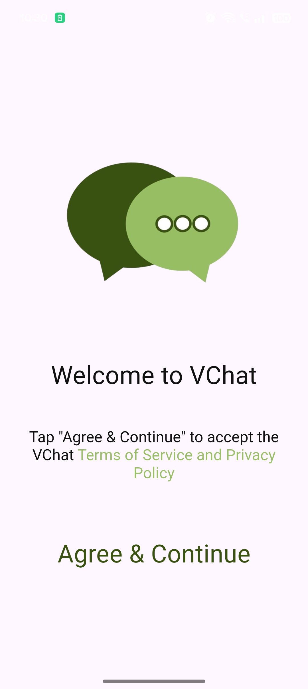
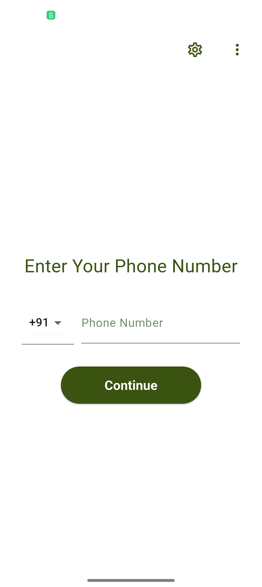
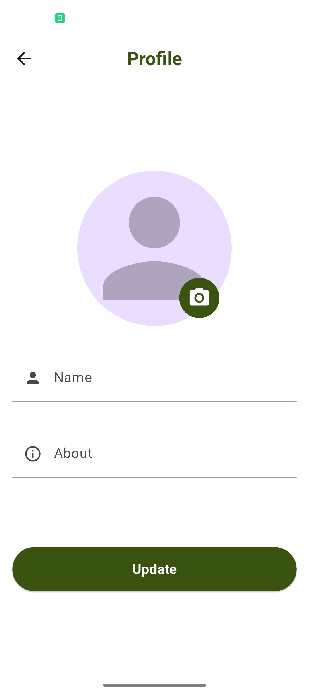
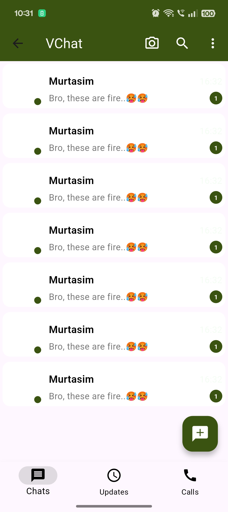
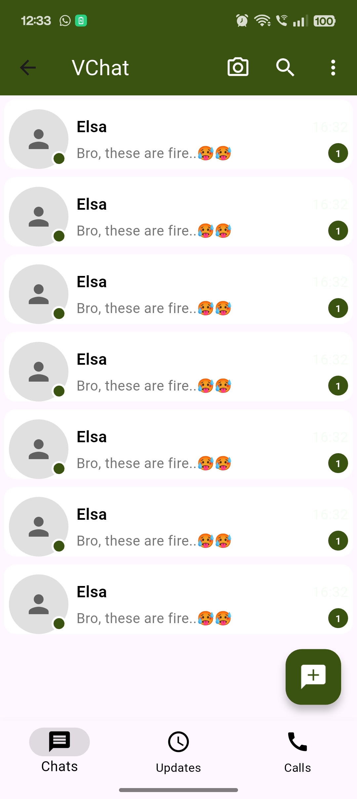
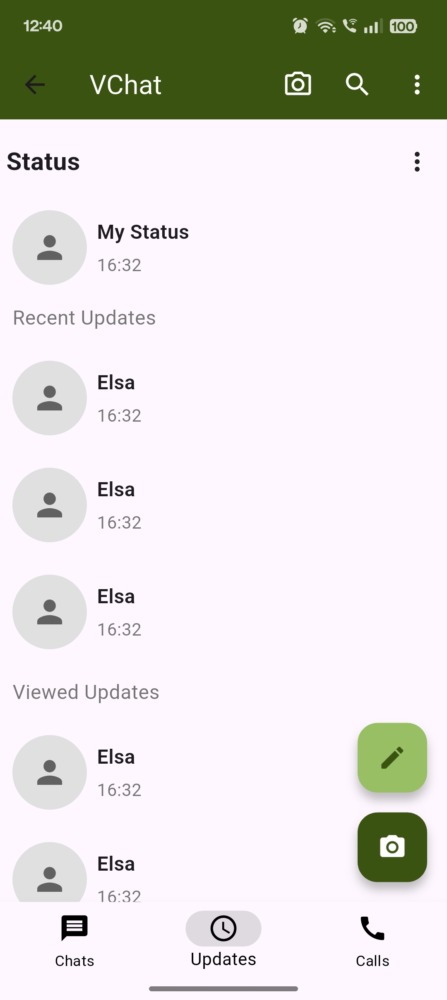
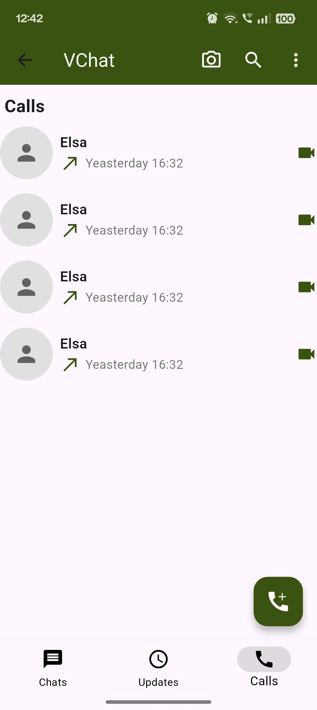

💬 VChat App

A WhatsApp-like UI app built with Flutter, designed to showcase modern messaging app interfaces.
This project focuses on providing a sleek and intuitive chat experience with well-structured screen designs.

📱 Screenshots

     
 
    

✨ Key Highlights

💬 Beautiful chat UI inspired by modern messaging apps

👥 Contact list and recent conversations screen

📩 Chat screen with message bubbles & timestamps

📸 Media preview and attachments support (UI design only)

🎨 Clean, responsive, and cross-platform design

📱 Built entirely with Flutter for Android & iOS

🚀 About This Repository

This repository is UI showcase only — no backend or messaging logic is implemented.
The purpose is to demonstrate elegant and functional chat app screen designs.

📬 Contact

If you’re interested in this project or would like to collaborate, feel free to reach out!
